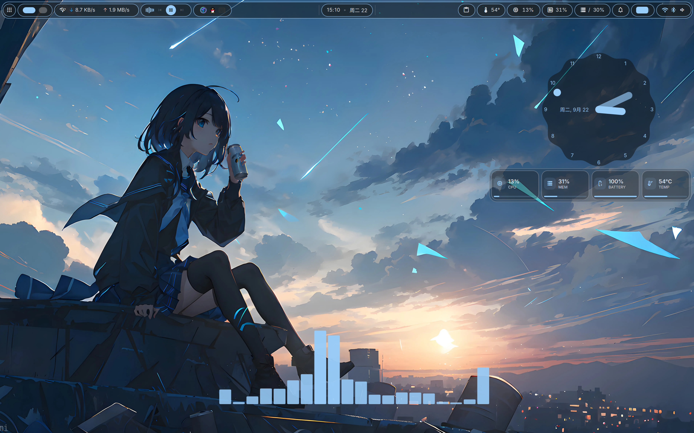

# Status Pill (DMS 桌面硬件监控挂件)



适用于 Arch Linux 下 **Niri** 窗口管理器的 **DankMaterialShell (DMS)** 极简桌面硬件监控插件。

## 功能特性

- 🖥️ **4 项核心指标实时监控**：
  - **CPU 使用率 (%)**: 实时主频、核心数、模型信息
  - **内存使用率 (%)**: 实时已用量与总量 (GiB)、Swap 使用状态
  - **电量与充电状态**: 实时电量百分比、充电指示、适配器 (AC) 供电自适应
  - **硬件温度 (°C)**: CPU 核心封装实时温度
- 🎨 **与 DMS Material 3 主题动态同步**：
  - 自动绑定当前壁纸/调色板的 `Theme.primary` 主题强调色
  - 支持在设置中选择 Primary / Secondary / Tertiary 或自定义颜色（Custom Color）
  - 高负荷/过热/低电量自动触发 `Theme.error` 告警强调
- 🎚️ **透明度与外观细致调节（参考桌面时钟）**：
  - **背景透明度 (0% - 100%)**: 0% 为无底框纯浮空文字，100% 为实心卡片
  - **边框开关 (Show Border)**: 开启/关闭精致细微描边
  - **独立显示开关 (Show CPU / MEM / Battery / Temperature)**: 支持单独开启或隐藏任意卡片
  - 文字、图标和微型指示条始终保持 100% 清晰易读
- 🖱️ **轻量交互与快捷启动**：
  - 悬停平滑展示详细数值浮层 (Tooltip)
  - 点击任意胶囊卡片一键唤起终端任务监控器（默认 `kitty -e btop`，可在设置中自定义）

## 安装与部署

1. **链接到 DMS 插件目录**：
   ```bash
   ln -s "$(pwd)" ~/.config/DankMaterialShell/plugins/statusPill
   ```

2. **重启 DMS 加载**：
   ```bash
   dms restart
   ```

3. **进入设置自定义**：
   - 打开 DMS 设置中心 (`Ctrl + ,`)
   - 在 **桌面部件 (Desktop Widgets)** 或 **插件 (Plugins)** 中找到 **Status Pill**
   - 可自由调节：
     - **背景透明度 (0% - 100%)**
     - **边框开关 (Show Border)**
     - **CPU / 内存 / 电池 / 温度各自的显示开关**
     - **主题色系模式 (Primary / Secondary / Tertiary / Custom)**
     - **自定义强调色 (Custom Accent Color)**
     - **刷新频率 (500ms - 3000ms)**
     - **点击启动命令**
     - **告警阈值**
